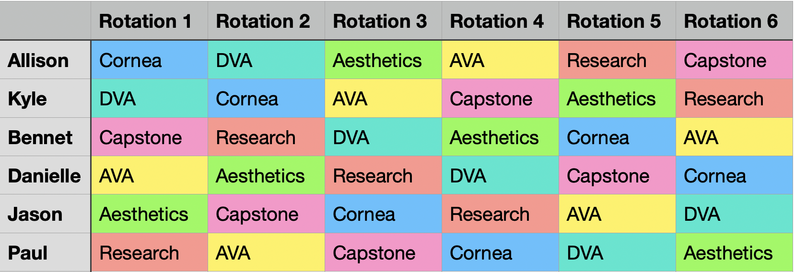
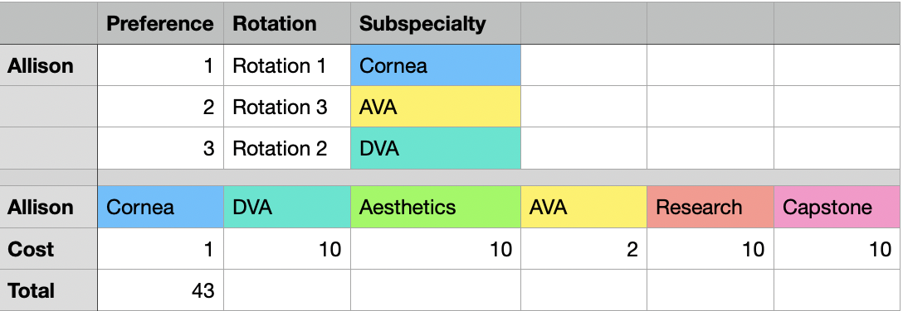
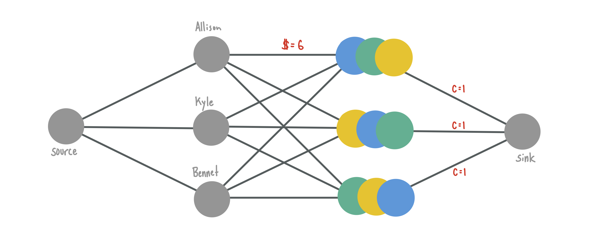
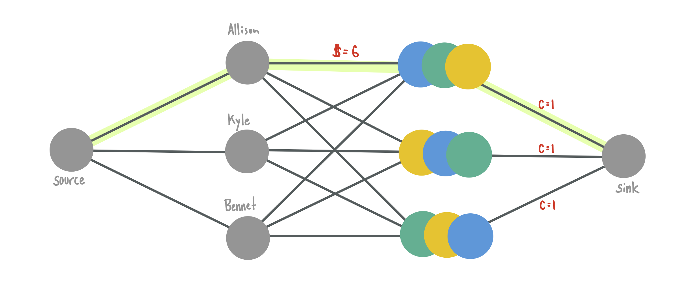
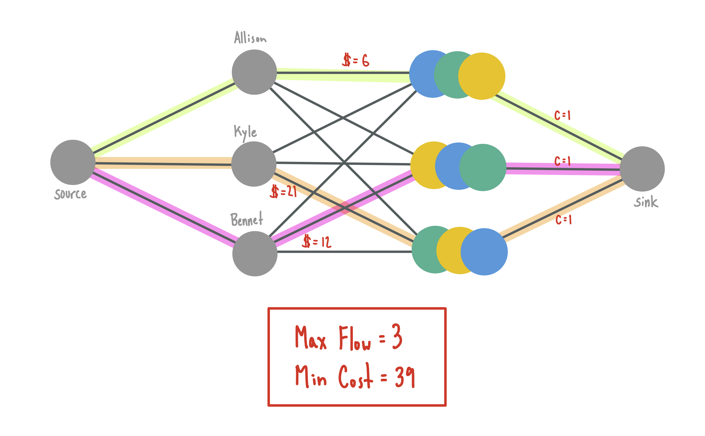
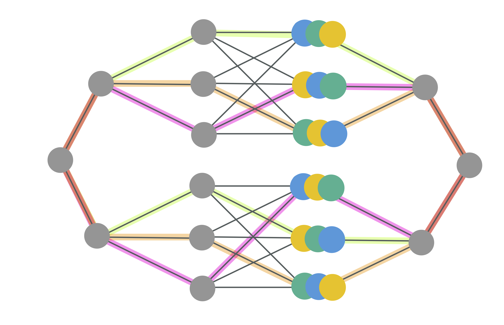
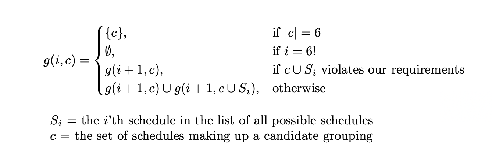
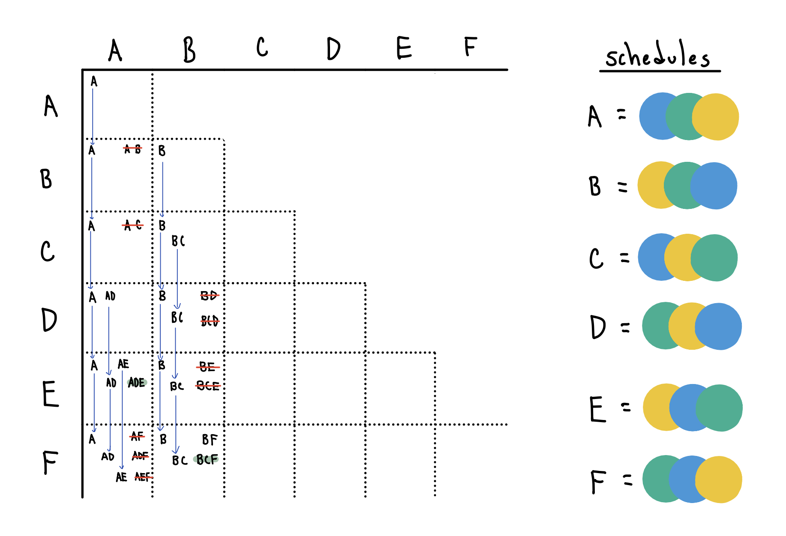

Consider the following problem:

> A class of 6 ophthalmology residents need to work together to build their class' schedules for the upcoming year. Each resident's year is split into 6 periods called "rotations", where each rotation must be assigned to one of six sub-specialty positions (e.g. Retina, Cornea, Oculoplastics, etc.). The following constraints must be met:
> - Each resident must complete each position exactly once at some point during the year
> - No resident can be assigned to the same sub-specialty during the same rotation

Here's an example of a valid schedule grouping for this class of 6:



The senior classes at my wife's ophthalmology residency program are faced with this every year, and it's traditionally been a major source of stress.

### Go with the flow.
This sounds a lot like the kind optimization problems I learned about in my algorithms class back in college. Indeed, after a *lot* of toying with the idea, I discovered that this can in fact be modeled as a network flow problem.

Network flow, and specifically min-cost/max-flow has a fascinating history<sub>1</sub> that I won't go into here, but one key take-away is that they're extremely useful for solving complex matching problems of the kind we've encountered here<sub>2</sub>

To model the problem such that we can eventually apply a flow-solving algorithm like Ford-Fulkerson<sub>3</sub>, we first need to identify the cost of an assignment. This is pretty simple If we ask each resident to provide a ranked list of rotation-to-subspecialty preferences. More-preferred assignments are assigned lower numerical costs and therefore an overall cost for any schedule/resident assignment can by derived by adding up the cost of each individual rotation-to-subspecialty preference for that resident.


*here we use a default high cost of 10 for assignments that did not have an associated preference to disincentivize non-preferred assignments.*

Next we need to construct a network flow that assigns residents to schedules in a schedule grouping . It's probably best to explain this using a smaller example. The image below is the graph assigning a class of 3 residents to 3 schedules.

One good analogy for understanding max flow graphs is to think of the water flowing through pipes. Edges correspond to pipes and nodes correspond to junctions. Each pipe (edge) has a limit on the amount of water that can be pumped through it (capacity). When the water reaches a junction (node), it may flow into any connected pipe as long as that pipe has capacity to accommodate it. Following this analogy, if we trace 
the flow of a single unit of water through our graph, it could look like this:

Here's what it looks like if we push the max amount of flow with minimum cost through the graph using an algorithm like Ford-Fulkerson.

Notice how each schedule node can accept at most one unit of flow from a resident due to the capacity constraint between the itself and the sink. This mechanism forces each resident to "choose" a unique schedule, represented by the cross edges containing flow.

This subgraph only represents one possible schedule grouping though. Our solution isn't complete until we've considered every valid schedule grouping and constructed a subgraph for each. Fortunately, creating parallel network flows is quite simple.

The max-flow / min-cost flow through this graph gives us the optimal assignment of residents to schedules for each valid schedule grouping, and a way to compare the total suffering cost of each schedule grouping. Once we extend this to our class of six residents, we have our solution!

### Not so fast.
Except to do this, we need to come up with a list of every possible schedule grouping that meets our requirements. We can express the algorithm for generating all groupings using this recurrence:

_note: `i` is initialized to zero and `c` is initialized as the empty set_.

Without being clever, this takes a **really** long time to complete for our class of 6. Luckily, it turns out there are gains to be had via Dynamic Programming. The recurrence at its core describes a pattern of comparing each schedule to every other possible schedule to build valid groups. I've found these "compare A with B" recurrences benefit from 2D matrix memoization structures. If we trace the path of execution through this structure, we find where the recurrence overlaps and in turn find our opportunity for improvement. Again, the example below is using schedules made of 3 subspecialties for clarity.

Specifically, there are two key optimizations we can glean from this:
1. Each cell in the matrix depends on the outcome of the cell **directly** above it. This overlap implies we can fill in each column iteratively instead of recursively.
2. Each column of the matrix is independent. This implies a natural place for us to parallelize.

This becomes the following in Python, which completes significantly faster than our original recursive solution. In case you're curious, it turns out there are ~1.13 million valid schedule groupings for our class of 6.

```python
from multiprocessing import Pool

# 6 factorial = 720 possible schedules in total
all_schedules = compute_all_schedules('Cornea', 'DVA', 'Aesthetics', 'AVA', 'Research', 'Capstone')

# 1.128 million valid and unique schedule groups
all_groups = compute_all_groupings(all_schedules)

def compute_all_groupings(all_schedules):
	parallelism_limit = 15
	all_groups = []
	with Pool(15) as p:
		for i in range(len(all_schedules)):
			column = all_schedules[i][i:]
			all_groups += p.starmap(compute_dp_column, (column))
			
	return all_groups

def compute_dp_column(schedules):
	valid_groups = []
	root_schedule = schedules[i]
    accumulated_groups = 

	for j in range(1, len(schedules)):
        candidate_schedule = schedules[j]
        for group in accumulated_groups:
			candidate_group = group[:] + [candidate_schedule]
	        if group_invalidates_requirements(candidate_group):
		        # don't add it for future consideration
	            continue
            elif len(candidate_group) == group_size:
	            # mark this group as valid, but don't add it for future consideration
                valid_groups.append(candidate_group)
            else:
	            # so far so good, but we haven't assembed a complete group yet.
                accumulated_groups.append(candidate_group)

	return valid_groups
```

### At last, we have it.
And so with our complete list of valid schedule groupings, we can construct our network and apply a flow solver to give us our rankings. After adding up the assignment costs and sorting by "least suffering", we end up with something like this:

```
Max flow:  6773760
Option 1 | Cost: 1266
	Allison      211 ['Cornea', 'DVA', 'Aesthetics', 'AVA', 'Research', 'Capstone']
	Kyle         211 ['DVA', 'Cornea', 'AVA', 'Capstone', 'Aesthetics', 'Research']
	Bennet       211 ['Capstone', 'Research', 'DVA', 'Aesthetics', 'Cornea', 'AVA']
	Danielle     211 ['AVA', 'Aesthetics', 'Research', 'DVA', 'Capstone', 'Cornea']
	Jason        211 ['Aesthetics', 'Capstone', 'Cornea', 'Research', 'AVA', 'DVA']
	Paul         211 ['Research', 'AVA', 'Capstone', 'Cornea', 'DVA', 'Aesthetics']

...

Option 1128960 | Cost: 1955
	Allison      309 ['Cornea', 'Research', 'Aesthetics', 'DVA', 'AVA', 'Capstone']
	Kyle         309 ['Aesthetics', 'DVA', 'AVA', 'Capstone', 'Research', 'Cornea']
	Bennet       310 ['Research', 'Capstone', 'DVA', 'Aesthetics', 'Cornea', 'AVA']
	Danielle     309 ['AVA', 'Cornea', 'Capstone', 'Research', 'Aesthetics', 'DVA']
	Jason        408 ['Capstone', 'Aesthetics', 'Cornea', 'AVA', 'DVA', 'Research']
	Paul         310 ['DVA', 'AVA', 'Research', 'Cornea', 'Capstone', 'Aesthetics']
```

You can see the complete code for this solver and try it for yourself [here](https://github.com/bladechapman/resident-schedule-optimizer-public).

### Some take-aways.
- **The more opinions, the better**. There end up being a lot of ties between groupings, which makes sense considering how many valid groupings exist. But so many ties in the top scoring groupings can lead to decision paralysis.
- **These rankings are guidance, not prescription**. People change their minds about their preferences once they have the rankings, and the importance of one person getting their top choice may not be the same as another's. So with that in mind, having these rankings in hand is most useful for encouraging productive negotiation.

---
[\[1\]](http://jeffe.cs.illinois.edu/teaching/algorithms/book/10-maxflow.pdf) Jeff Erickson's *Algorithms* provides a great summary of how max-flow/min-cuts date back to the Cold War, where they were used to analyze how to disrupt Russian rail networks as efficiently as possible.

[\[2\]](http://jeffe.cs.illinois.edu/teaching/algorithms/book/11-maxflowapps.pdf) Jeff Erickson's *Algorithms* again has a great chapter covering the many applications of network flows, including bipartite matching.

[\[3\]](https://en.wikipedia.org/wiki/Ford–Fulkerson_algorithm) The Ford-Fulkerson algorithm for finding the maximum flow in a network. Note that this is only one example as other algorithms exist, including Shimbel-Bellman-Ford (useful for when negative cost flows exist in the graph)

